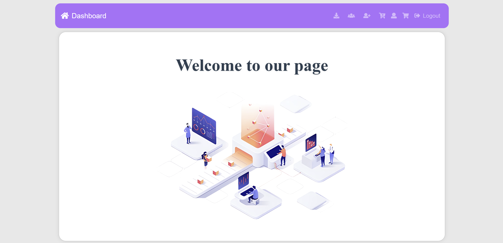
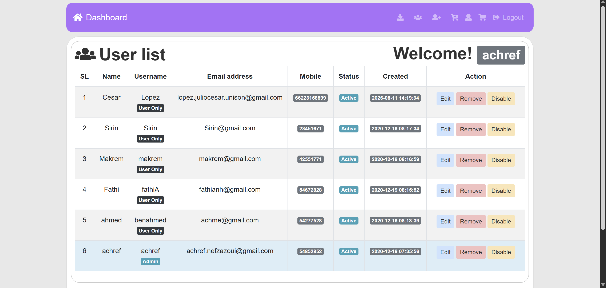
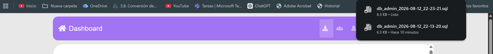
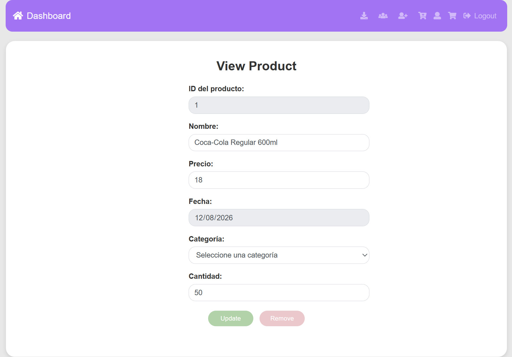
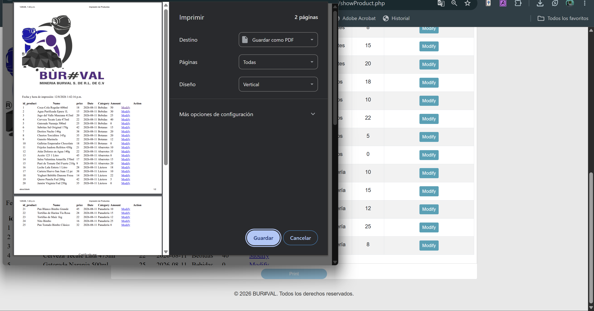

# Admin Panel Management (PHP + MySQL)

Pequeño panel de administración en PHP para gestionar usuarios y productos. Las Funciones de la aplicaion seran segun el rol que tengas como usuario

Características Generales
- Registro y login de usuario (Usando SHA1 para contraseñas).
- Recuperación/edición de perfil y cambio de contraseña.
- Consultar inverntario de productos e imprimir la lista de productos

Caracteristicas Admin
- Panel de administración: gestión de usuarios (listar, añadir, editar, borrar), gestión de productos (CRUD).
- Boton para descargar Backup de base de datos solo para usuario administrador


Requisitos
- PHP (7.4+ recomendado) y MySQL/MariaDB
- XAMPP, WAMP o similar para ejecución local
- Composer (para dependencias PHP)
- Opcional: Node.js si vas a usar las pruebas Cypress

Instalación y ejecución local
1. Clona o copia el proyecto dentro de la carpeta pública de tu servidor local (p.ej. `xampp/htdocs/`).
2. Asegúrate de tener Apache y MySQL arrancados (XAMPP Control Panel).
3. Instala dependencias PHP:

```bash
composer install
```

4. Crea la base de datos y importa el dump (`db_admin.sql`) usando phpMyAdmin o línea de comandos:

phpMyAdmin: sube `db_admin.sql` en tu base de datos `db_admin`.

Línea de comandos:
```bash
mysql -u root -p db_admin < path/to/db_admin.sql
```

5. Configura la conexión a la BD en `config/config.php` (usuario, contraseña, nombre de BD).
6. Abre en el navegador: `http://localhost/<ruta-del-proyecto>/index.php`

Credenciales por defecto (cambia inmediatamente):
- Usuario admin: `achref.nefzazoui@gmail.com`
- Contraseña: `Achref1`

Capturas / imágenes


- Pantalla Inicio


- Vista del Usuario


- Vista del Administrador


- Descargar Backup de base de datos


- Modificar Producto


- Imprimir Producto



Este fue un proyecto escolar para la materia de Ingenieria de Software 1 en 2024.
